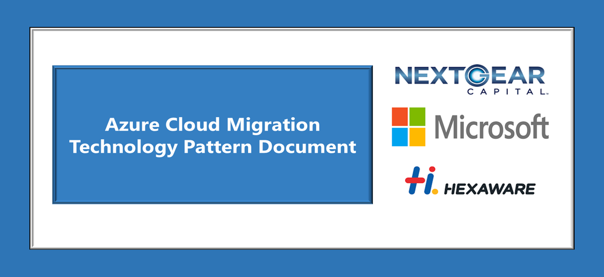
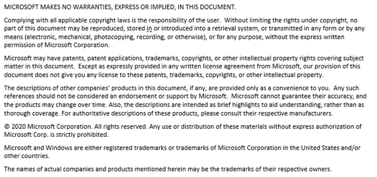
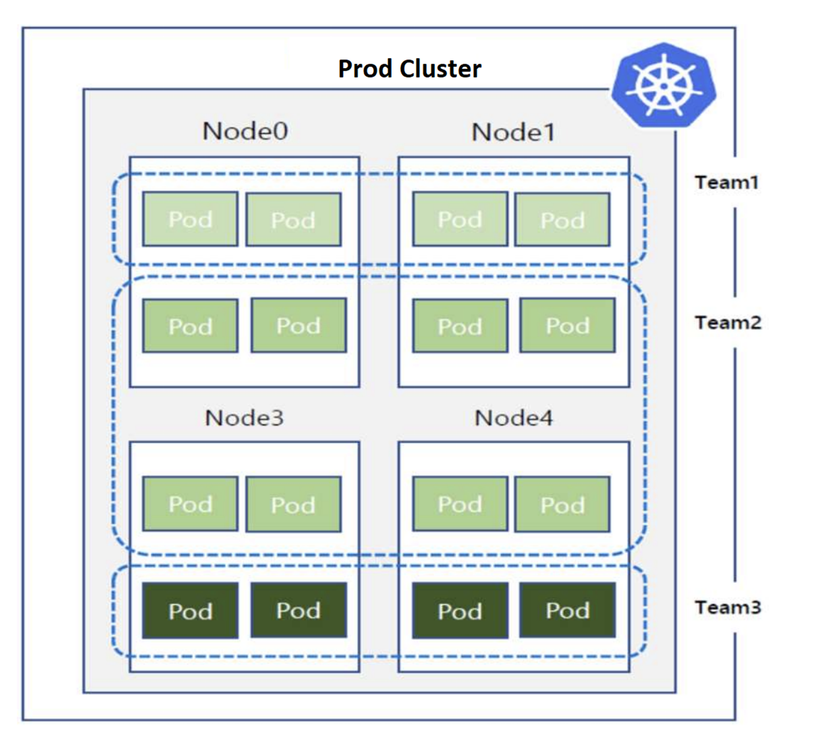
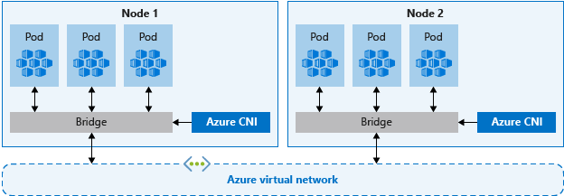
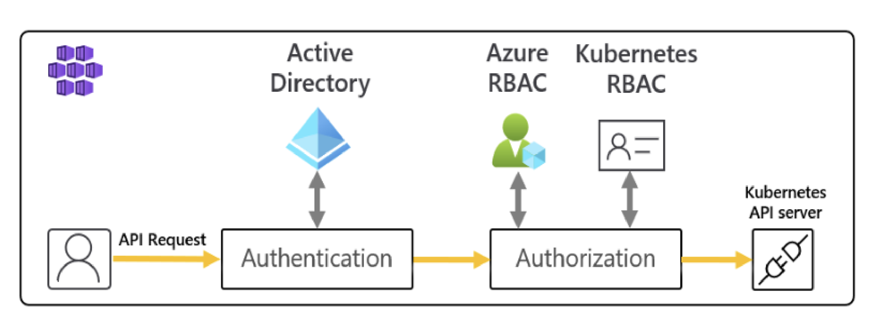

  

**Revision and Signoff Sheet**

**Change Record**

| **Date**   | **Author**      | **Version** | **Change Reference**                |
|------------|-----------------|-------------|-------------------------------------|
| 04/13/2023 | Praveen Kumar G | 0.1         | Initial draft for review/discussion |
| 04/17/2023 | Praveen Kumar G | 1.0         | Document Formatted                  |
|            |                 |             |                                     |

**Reviewers**

| **Name** | **Version Approved** | **Position** | **Date** |
|----------|----------------------|--------------|----------|
| Ashish   |                      |              |          |

# 

# **Table of Contents**

[1 Context and Problem Statement
[6](#context-and-problem-statement)](#context-and-problem-statement)

[1.1 Overview [6](#overview)](#overview)

[1.2 Problem [6](#problem)](#problem)

[2 When to use the Pattern
[7](#when-to-use-the-pattern)](#when-to-use-the-pattern)

[2.1 Cases [7](#cases)](#cases)

[3 Solution [8](#solution)](#solution)

[3.1 High Level Architecture
[8](#high-level-architecture)](#high-level-architecture)

[3.2 Solution [9](#solution-1)](#solution-1)

[3.2.1. AKS Design Decisions
[9](#aks-design-decisions)](#aks-design-decisions)

[3.2.2. Cluster Isolation [11](#cluster-isolation)](#cluster-isolation)

[3.2.3. Compute [12](#compute)](#compute)

[3.2.3.1. Resource reservation guidance
[12](#resource-reservation-guidance)](#resource-reservation-guidance)

[3.2.4. Network Design [13](#network-design)](#network-design)

[3.2.4.1. Virtual Network [13](#virtual-network)](#virtual-network)

[3.2.4.2. Subnet Planning [14](#subnet-planning)](#subnet-planning)

[3.2.4.3. Kubernetes Service Address Range
[14](#kubernetes-service-address-range)](#kubernetes-service-address-range)

[3.2.4.4. Network Policy [14](#network-policy)](#network-policy)

[3.2.4.5. Cluster Ingress [15](#cluster-ingress)](#cluster-ingress)

[3.2.4.6. Cluster Egress [15](#cluster-egress)](#cluster-egress)

[3.2.5. Azure Container Registry (ACR)
[15](#azure-container-registry-acr)](#azure-container-registry-acr)

[3.2.6. Azure Key Vault Integration
[16](#azure-key-vault-integration)](#azure-key-vault-integration)

[3.2.7. AKS Resource Management and Scaling
[16](#aks-resource-management-and-scaling)](#aks-resource-management-and-scaling)

[3.2.8. Identity and Access Management
[17](#identity-and-access-management)](#identity-and-access-management)

[3.2.8.1. Azure AD RBAC and Kubernetes RBAC
[17](#azure-ad-rbac-and-kubernetes-rbac)](#azure-ad-rbac-and-kubernetes-rbac)

[3.2.9. Azure AD and AKS Integration
[17](#azure-ad-and-aks-integration)](#azure-ad-and-aks-integration)

[4. Deployment Strategy
[18](#deployment-strategy)](#deployment-strategy)

[4.2. Recommended Strategy
[18](#recommended-strategy)](#recommended-strategy)

[4.2.1. Manual/CD [18](#manualcd)](#manualcd)

[5. Related Guideline [19](#related-guideline)](#related-guideline)

[5.2. Supported/Reference Links
[19](#supportedreference-links)](#supportedreference-links)

**  
**

# **Context and Problem Statement**

## **Overview**

> NGC currently hosts business-critical apps on Nomad clusters and is
> looking to migrate an on-premises applications to AKS. This Pattern
> outlines AKS consumption and Nomad cluster migrations.

## **Problem**

> NGC currently hosts their Spring application on a Nomad cluster
> on-premises. As part of migration of application to cloud, after
> evaluating different options, Azure Kubernetes Service (AKS) has been
> identified as a suitable solution for hosting and managing the
> application.

**  
**

# **When to use the Pattern**

## **Cases**

> Here are some possible scenarios for utilizing this pattern:

- Container guidance required when migrating applications to Azure
  cloud.

- Developing applications in Azure Kubernetes Service.

- Service enablement and NGC allowed features of AKS service.

**  
**

# **Solution** 

## **High Level Architecture**

>  alt="A picture containing text, screenshot, diagram, font Description automatically generated" />

**Figure 1**: AKS Sample Architecture

This architecture describes a high-level deployment of AKS and other
relaxant infrastructure.

- Nginx will be used as an ingress controller for applications front
  end.

- Helm / Manifest files will be used for installation of addons (Nginx
  and Kured)

- Based on CPU and Memory threshold set, pods will be scaled out or in
  using Horizontal Pod Autoscaling (HPA).

- Authentication to cluster would be managed using RBAC roles and Azure
  Active Directory groups.

- Azure Key Vault is for secrets store, CSI driver will provide the
  secure method to fetch secrets from Azure Key Vault.

Note: Currently the image repository decision is pending.

## **Solution** 

### **AKS Design Decisions**

Azure Kubernetes Service (AKS) is a fully managed service that
simplifies the deployment and management of containerized applications
using Kubernetes orchestration. It provides a highly available,
scalable, and secure platform for running containerized workloads,
including features like automatic scaling, rolling updates, and
self-healing capabilities.

AKS architecture consists of several components, The information in the
table below is the AKS feature-set design recommendations for NGC:

<table>
<colgroup>
<col style="width: 17%" />
<col style="width: 26%" />
<col style="width: 27%" />
<col style="width: 27%" />
</colgroup>
<thead>
<tr class="header">
<th>Category </th>
<th>Topic </th>
<th>Decision </th>
<th>Notes</th>
</tr>
</thead>
<tbody>
<tr class="odd">
<td>Cluster Topology </td>
<td>Cluster Isolation</td>
<td>NGC to decide to deploy multiple clusters, depending on application
mapping with subscriptions.</td>
<td></td>
</tr>
<tr class="even">
<td></td>
<td>Container Registry</td>
<td>Coxautoinc Artifactory to be used.</td>
<td>Evaluation required.</td>
</tr>
<tr class="odd">
<td></td>
<td>
AKS Cluster Type

Node SKU type and count

AKS Cluster Region
</td>
<td>
Private Cluster

Standard_DS3_v2 (Default)

East US (primary)
</td>
<td></td>
</tr>
<tr class="even">
<td></td>
<td>Availability Zones</td>
<td>2</td>
<td>All the Clusters in Production, Non-Prod Environment are deployed in
2 Availability Zones</td>
</tr>
<tr class="odd">
<td></td>
<td>Single Region/ Multi region</td>
<td>
Single region (Gold Tier)

Multi-Region (Diamond, Platinum and Platinum plus)
</td>
<td>It depends on application resiliency tier.</td>
</tr>
<tr class="even">
<td></td>
<td>Disaster Recovery</td>
<td>Multi-Region deployment for Diamond, Platinum plus and Platinum
tiers.</td>
<td></td>
</tr>
<tr class="odd">
<td></td>
<td>Node Scalability</td>
<td>Cluster auto-scaling</td>
<td>Refer to Section 3.2.8</td>
</tr>
<tr class="even">
<td></td>
<td>POD Scalability</td>
<td>Horizontal Pod Autoscaling (HPA)</td>
<td>Refer to Section 3.2.8</td>
</tr>
<tr class="odd">
<td rowspan="9">Networking </td>
<td>Type </td>
<td>Azure CNI</td>
<td></td>
</tr>
<tr class="even">
<td>Ingress Controller </td>
<td>Nginx</td>
<td></td>
</tr>
<tr class="odd">
<td>Virtual Network</td>
<td>VNet would be shared with other application resources.</td>
<td></td>
</tr>
<tr class="even">
<td>Subnet</td>
<td>
2 Dedicated subnets for:

<ul>
<li>
System node pool
</li>
<li>
User node pool
</li>
</ul></td>
<td>Refer section 3.2.4.2</td>
</tr>
<tr class="odd">
<td>Service CIDR</td>
<td>Based on microservices per cluster</td>
<td></td>
</tr>
<tr class="even">
<td></td>
<td></td>
<td></td>
</tr>
<tr class="odd">
<td>Load Balancer</td>
<td>Standard Load Balancer</td>
<td>Internal load balancer with standard SKU</td>
</tr>
<tr class="even">
<td>Egress Traffic</td>
<td>Restrict Egress Traffic using Azure Firewall</td>
<td>
Route all the egress traffic from AKS Subnets

(System and user node pools) to Azure Firewall.
</td>
</tr>
<tr class="odd">
<td>Ingress Traffic</td>
<td>Nginx Ingress controller</td>
<td></td>
</tr>
<tr class="even">
<td rowspan="2">Security </td>
<td>Access Control </td>
<td>Azure AD / Managed Identity (MI)</td>
<td>MI is needed to dynamically create and manage azure resources and MI
is preferred over Service Principal.</td>
</tr>
<tr class="odd">
<td>Secrets </td>
<td>Key Vault to be used for Kubernetes secrets</td>
<td>AKS MI will be given access over Key vault to access secrets.</td>
</tr>
<tr class="even">
<td></td>
<td>POD security policy</td>
<td>NA</td>
<td>No pod security policies are needed.</td>
</tr>
<tr class="odd">
<td></td>
<td>Networking Policy</td>
<td>NA</td>
<td>No network policy solution is needed.</td>
</tr>
<tr class="even">
<td rowspan="2">Observability </td>
<td>
Monitoring 

Application Logging
</td>
<td>New Relic &amp; Azure Monitor</td>
<td></td>
</tr>
<tr class="odd">
<td>Logging </td>
<td><strong>Decision Pending</strong></td>
<td>Evaluation in progress to move from Grey log to Log Analytics
workspace</td>
</tr>
<tr class="even">
<td>Storage </td>
<td> </td>
<td>No additional storage needs.</td>
<td></td>
</tr>
<tr class="odd">
<td rowspan="2">DevOps </td>
<td>Infra as Code Tool </td>
<td>Terraform</td>
<td>Terraform is the standard for Infrastructure-as-code (IAC). It will
be used to deploy infrastructure.</td>
</tr>
<tr class="even">
<td>Application</td>
<td><strong>Decision Pending</strong></td>
<td>Evaluation in progress to choose between Helm and Flux</td>
</tr>
</tbody>
</table>

Table 1 – AKS Design Discussion

### **Cluster Isolation**

AKS provides built-in flexibility to isolate resources inside a cluster.
NGC will use a Logical Isolation Strategy. Logical Isolation can be
achieved by:

- Namespaces

- Network Policies

- Authentication and Authorization (Kubernetes RBAC)

- Container Level Isolation

In logical isolations, namespaces inside the cluster is the security
boundary. The user deploying the resources in a namespace would have no
permissions on other namespaces.

The following diagram shows the cluster Isolation model.

Figure 2 - Cluster Isolation

### **Compute**

#### **Resource reservation guidance**

**CPU** - Reserved CPU is dependent on node type and cluster
configuration which may cause less allocable CPU due to running
additional features.

| CPU cores on host           | 1   | 2   | 4   | 8   | 16  | 32  | 64  |
|-----------------------------|-----|-----|-----|-----|-----|-----|-----|
| Kube-reserved (milli cores) | 60  | 100 | 140 | 180 | 260 | 420 | 740 |

**Memory** - A node must always have at least 750 Mi allocable memory.
Memory reservations for kubelet daemon to function properly
(kube-reserved):

- 25% of the first 4 GB of memory

- 20% of the next 4 GB of memory (up to 8 GB)

- 10% of the next 8 GB of memory (up to 16 GB)

- 6% of the next 112 GB of memory (up to 128 GB)

- 2% of any memory above 128 GB

### **Network Design**

AKS supports two types of networking – basic and advanced. Azure
CNI assigns IP addresses to pods and nodes and provides IP address
management (IPAM) features as you connect to existing Azure virtual
networks. Each node and pod resource receive an IP address in the Azure
virtual network, and no additional routing is needed to communicate with
other resources or services.

Figure
5 - Azure advanced networking

The following prerequisites must be fulfilled before deploying an AKS
cluster: 

- The virtual network for the AKS cluster must allow outbound internet
  connectivity. 

- Ensure AKS Cluster is deployed in individual subnets. 

- AKS clusters may not use 169.254.0.0/16, 172.30.0.0/16, 172.31.0.0/16
  or 192.0.2.0/24 for the Kubernetes service address range. 

<table>
<colgroup>
<col style="width: 100%" />
</colgroup>
<thead>
<tr class="header">
<th><strong>Decision</strong></th>
</tr>
</thead>
<tbody>
<tr class="odd">
<td><ol type="1">
<li>
NGC will use Advanced Networking with the Azure Container Network
Interface (<a
href="https://docs.microsoft.com/en-us/azure/aks/configure-azure-cni">CNI</a>)
&amp; Calico for network policy. This will allow direct access to the
pods as needed, and provide support for <a
href="https://docs.microsoft.com/en-us/azure/virtual-network/virtual-network-service-endpoints-overview">service
endpoints</a> and <a
href="https://blogs.msdn.microsoft.com/igorpag/2016/05/14/azure-network-security-groups-nsg-best-practices-and-lessons-learned/">network
security groups</a>.
</li>
<li>
NGC will route the internet traffic to Azure Firewall.
</li>
</ol></td>
</tr>
</tbody>
</table>

#### **Virtual Network** 

Virtual Network (VNet) and subnet planning are crucial to AKS design,
especially in Azure CNI mode.

The size of Virtual Network and its subnet must accommodate the number
of pods, the number of nodes and number of load balancers for the
cluster. Each node is configured with a primary IP address. By default,
30 additional IP addresses are pre-configured by Azure CNI that are
assigned to pods scheduled on the node.

#### **Subnet Planning** 

When using Azure Kubernetes Service with Azure Container Network
Interface (CNI), every pod gets an IP address of the subnet. NGC needs
to ensure that subnet size should consider upgrading operations or
future scaling needs.

It is recommended to create a virtual network with 3 subnets:

1.  AKS system node pool subnet

2.  AKS user node pool subnet

3.  Private endpoints subnet

The formula for subnet sizing is: (Number of nodes + 1) + (number of
nodes + 1) \* maximum number of pods per node that would be configured).

Note:

- Ensuring that address ranges configured within the cluster do not
  overlap with other virtual networks in your environment which the
  cluster virtual network peers.

- Ensure AKS subnet is protected with Network Security Group (NSG).

#### **Kubernetes Service Address Range** 

Kubernetes service address range (CIDR) is a set of virtual IPs that
Kubernetes assigns to internal services in AKS. This range should not be
used by any network on or connected to the AKS Virtual Network.

#### **Network Policy**

Network policy is a Kubernetes feature that enables control of traffic
flows between pods. Administrators can choose to allow or deny traffic
based on settings such as assigned labels, namespace, or traffic port.
The use of network policies gives a cloud-native way to control the flow
of traffic. As pods are dynamically created in an AKS cluster, the
required network policies can be automatically applied.

Note: Azure network security groups should not be used to control
pod-to-pod traffic. Instead, use network policies. 

| **Decision**                           |
|----------------------------------------|
| NGC to proceed without network policy. |

#### **Cluster Ingress**

Cluster ingress is a Kubernetes resource that manages external access to
services in a Kubernetes cluster. It acts as an entry point for all
external traffic destined for services running in the cluster. The
specific controller implementation and configuration typically depends
on application specific routing requirements such as:

- Host and/or path-based routing

- Custom header processing

| **Decision**                                 |
|----------------------------------------------|
| Nginx will be used as an ingress controller. |

#### **Cluster Egress**

By default, AKS clusters have unrestricted outbound (egress) internet
access. For management and operational purposes, nodes in an AKS cluster
need to access certain ports and fully qualified domain names (FQDNs).
These endpoints are required for the nodes to communicate with the API
server, or to download and install core Kubernetes cluster components
and node security updates.

In AKS, there are two sets of ports and addresses: 

- The [required ports and address for AKS
  clusters](https://docs.microsoft.com/en-us/azure/aks/limit-egress-traffic#required-ports-and-addresses-for-aks-clusters) lists
  the minimum requirements for authorized egress traffic to AKS
  clusters. 

- The [optional recommended addresses and ports for AKS
  clusters](https://docs.microsoft.com/en-us/azure/aks/limit-egress-traffic#optional-recommended-addresses-and-ports-for-aks-clusters) aren't
  required for all scenarios, but integration with other services such
  as Azure Monitor won't work correctly if the right addresses and ports
  are not set.

| **Decision**                                                                                                                                                              |
|---------------------------------------------------------------------------------------------------------------------------------------------------------------------------|
| When limiting egress traffic to public internet, route all egress traffic from AKS Subnets (system and user node pools) to Azure Firewall to control access the internet. |

### **Azure Container Registry (ACR)**

ACR provides all required features as well as some additional benefits.
Using central ACR (one per production and non-production environments)
will ease image maintenance and operations involved.

| **Decision**                                           |
|--------------------------------------------------------|
| NGC to use CoxAutoInc Artifactory as image repository. |

### **Azure Key Vault Integration**

The Azure Key Vault Provider for Secrets Store CSI Driver allows for the
integration of an Azure key vault as a secret store with an Azure
Kubernetes Service (AKS) cluster via a CSI volume.

KeyVault secrets store provide the following features: -

- Mounts secrets, keys, and certificates to a pod by using a CSI volume.

- Supports CSI inline volumes.

- Supports mounting multiple secrets store objects as a single volume.

- Supports pod portability with the SecretProviderClass CRD

- Syncs with Kubernetes secrets

- Supports auto rotation of mounted contents and synced Kubernetes
  secrets.

| **Decision**                                                                                              |
|-----------------------------------------------------------------------------------------------------------|
| Azure Key Vault provider for Secrets store CSI driver will be used to fetch secrets from Azure Key vault. |

### **AKS Resource Management and Scaling**

Scaling will be primarily done on nodes and pods metrics (Memory, CPU
usage) and later specific application stack metrics might be used.

In the following section, there are two scaling options:

- The cluster autoscaler watches for pods that can't be scheduled on
  nodes because of resource constraints. The cluster then automatically
  increases the number of nodes.

- The Horizontal Pod Autoscaler (HPA) uses the Metrics Server in a
  Kubernetes cluster to monitor the resource demand of pods. If an
  application needs more resources, the number of pods is automatically
  increased to meet the demand.

<table>
<colgroup>
<col style="width: 100%" />
</colgroup>
<thead>
<tr class="header">
<th><strong>Decision</strong></th>
</tr>
</thead>
<tbody>
<tr class="odd">
<td><ul>
<li>
Horizontal Pod Autoscaling will be used to automatically scale
pods.
</li>
<li>
Autoscaling will be enabled for nodes.
</li>
</ul></td>
</tr>
</tbody>
</table>

### **Identity and Access Management**

#### **Azure AD RBAC and Kubernetes RBAC**

To provide granular filtering of the actions that users can perform,
Kubernetes uses role-based access controls (RBAC). This control
mechanism lets organizations assign users, or groups of users,
permission to do things like create or modify resources, or view logs
from running application workloads. These permissions can be scoped to a
single namespace or granted across the entire AKS cluster.

| **Decision**                                                                                              |
|-----------------------------------------------------------------------------------------------------------|
| Use Kubernetes RBAC to define the permissions that users or groups must have to resources in the cluster. |

### **Azure AD and AKS Integration**

The integration of Azure Active Directory (AD) can significantly improve
the security of AKS clusters. By leveraging Azure AD, the identity
management component is centralized, ensuring that any changes in user
accounts or group status are automatically reflected in access rights
within the AKS cluster. 

Figure 7- Azure AD
and AKS Integration

It is recommended to use Azure AD for managing cluster access and
assigning granular permissions. AD integration can be extended with Pod
identity. There are four built-in Azure RBAC roles available for AKS:
RBAC Viewer, RBAC Writer, Admin, and Cluster Admin.

**  
**

# **Deployment Strategy** 

## **Recommended Strategy**

### **Manual/CD**

Here is the recommendation for deployment of infrastructure and
microservices:

- Infrastructure deployment – Terraform.

- AKS Addon installations – Addon’s official installation method

- Application release - **Decision Pending** (Evaluation in-progress to
  choose between Helm and Flux)

**  
**

# **Related Guideline** 

## **Supported/Reference Links**

Azure - <https://learn.microsoft.com/en-us/azure/?product=popular>

Managed Identity -
<https://learn.microsoft.com/en-us/azure/aks/use-managed-identity>

AKS - <https://learn.microsoft.com/en-us/azure/aks/>

Nginx - <https://docs.nginx.com/nginx-ingress-controller/>

Key Vault -
<https://learn.microsoft.com/en-us/azure/key-vault/general/basic-concepts>

Secret Store CSI Driver -
<https://learn.microsoft.com/en-us/azure/aks/csi-secrets-store-driver>
